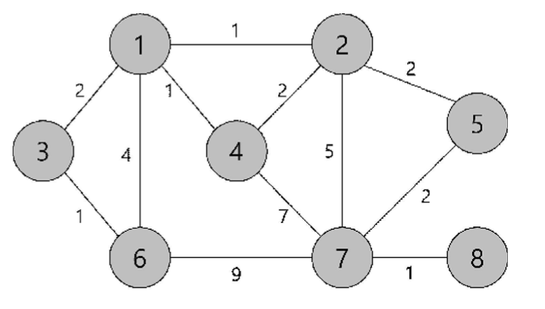

<h1><strong >최단경로 - Dijkstra & BellmanFord 알고리즘 </strong></h1>

## 문제 1 (Dijkstra 알고리즘) 무방향 양의 가중그래프에서 최단거리 찾기 
무방향 양의 가중그래프(undirectedweighted graph) G 와 출발정점이 주어지면, 출발정점에서 다른 모든 정점으로
가는 최단거리 를 구하는 프로그램을 작성하라.

### 1. 입력 그래프 성질
- n ( 1 ≤ n ≤ 100 )개의 정점과 m ( 1 ≤ m ≤ 1,000 )개의 간선으로 구성.
- 정점은 1 ~ n 사이의 정수로 번호가 매겨져 있고, 정점의 번호는 모두 다름.
- 모든 간선은 무방향간선 이다.

### 2. 입력
- 첫 줄에 정점의 개수 `n`, 간선의 개수 `m`, 출발정점 번호 `s`가 주어진다.
- 이후 `m` 개의 줄에 한 줄에 하나씩 간선의 정보(간선의 양 끝 정점 번호, 무게)가
  주어진다. 최대로 가능한 가중치는 **20** 을 넘지 않는다고 가정한다.
  간선은 **임의의 순서로 입력되고, 중복 입력되는 간선은 없다** (무방향간선이므로 간선
  ( **u** , **v** )와 ( **v** , **u** )는 동일한 간선으로 취급).

### 3. 출력
- 출발정점 `s` 에서 다른 모든 정점으로의 최단거리를 출력한다. 한 줄에 한 정점과 그
  정점까지의 거리를 출력하되, 출력하는 순서는 정점의 번호의 오름차순으로 출력한다.
  도달할 수 없는 정점은 출력하지 않는다.

### 4. 예시

|입력 예시| 출력 예시|
|---|---|
|5 7 1↦ n = 5, m = 7, s = 1|2 1|
|1 2 1 |3 2|
|1 4 5 |4 3|
|5 1 10 |5 5|
|3 5 3 ||
|4 3 1 ||
|3 1 2 ||
|2 3 2 ||

|입력 예시| 출력 예시|
|---|---|
|8 12 7↦ n = 8, m = 12, s = 7|1 5|
|1 2 1|2 4|
|2 4 2|3 7|
|4 7 7|4 6|
|3 6 1|5 2|
|6 1 4|6 8|
|7 6 9|8 1|
|7 8 1||
|1 3 2||
|2 7 5||
|1 4 1||
|2 5 2||
|7 5 2||

|입력 예시| 출력 예시|
|---|---|
|5 3 2↦ n = 5, m = 3, s = 2|1 1|
|1 2 1|3 2|
|1 3 1|4 2|
|1 4 1||

---

## 문제 2 (BellmanFord 알고리즘) 방향 가중그래프에서 최단거리 찾기 
방향 가중그래프(directed weighted graph) G와 출발정점이 주어지면, 출발정점에서 다른 모든 정점으로 가는 최단거리를 구하는 프로그램을 작성하라.

### 1. 입력 그래프 성질
- n(1 ≤ n ≤ 100)개의 정점과 m(1 ≤ m ≤ 1,000)개의 간선으로 구성.
- 정점은 1 ~ n 사이의 정수로 번호가 매겨져 있고, 정점의 번호는 모두 다름.
- 모든 간선은 **방향간선**이고, 무게를 가진다(**음의 가중치**도 허용).
- 음의 사이클을 가지는 그래프는 입력되지 않는다고 가정.

### 2. 입력
- 첫 줄에 정점의 개수 `n`, 간선의 개수 `m`, 출발정점 번호 `s`가 주어진다.
- 이후 `m`개의 줄에 한 줄에 하나씩 간선의 정보(간선의 양 끝 정점 번호, 무게)가
  주어진다. 최대로 가능한 가중치는 **20**을 넘지 않는다고 가정한다.
  간선은 **임의의 순서로 입력되고, 중복 입력되는 간선은 없다** (무방향간선이므로 간선 (**u**, **v**)와 (**v**, **u**)는 동일한 간선으로 취급).

### 4. 출력
- 출발정점 `s`에서 다른 모든 정점으로의 최단거리를 출력한다. 한 줄에 한 정점과 그 정점까지의 거리를 출력하되, 출력하는 순서는 정점의 번호의 오름차순으로 출력한다. 도달할 수 없는 정점은 출력하지 않는다.

### 5. 예시

|입력 예시| 출력 예시|
|---|---|
|5 7 1 ↦ n = 5, m = 7, s = 1 |2 -1|
|1 2 1 ↦ 정점, 정점, 무게 |3 2|
|1 4 5 |4 3|
|5 1 -2 |5 5|
|3 5 3 | |
|3 4 1 | |
|1 3 2 | |
|3 2 -3 | |

|입력 예시| 출력 예시|
|---|---|
|4 5 1 ↦ n = 2, m = 2, s = 1 |2 1|
|1 2 1|3 -1|
|2 3 -2 |4 0|
|3 1 2 | |
|3 4 1 | |
|1 4 5 | |